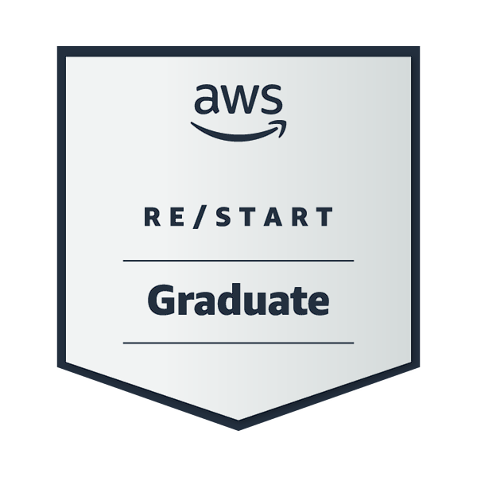
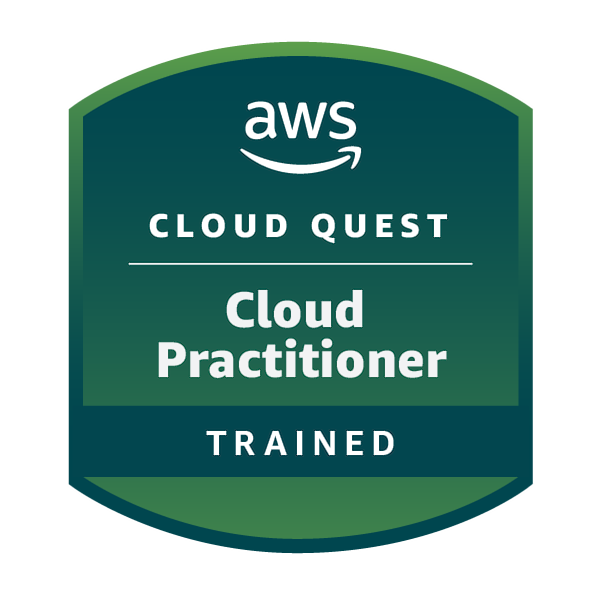

# Certifications and Training

This folder records the certifications, badges, and structured learning completed by **Olivia Aluwani Mahuluhulu** during and after the AWS re/Start programme.

## AWS Certification

### AWS Certified Cloud Practitioner

**Status: Earned**

This certification validates foundational knowledge of AWS Cloud concepts, core services, security and compliance, billing, pricing, and support.

## AWS re/Start

### AWS re/Start Graduate Badge

The AWS re/Start Graduate Badge confirms successful completion of the programme's cloud, Linux, networking, security, database, and professional-skills curriculum.

## Additional training and badges

### AWS Cloud Quest: Cloud Practitioner

Completed interactive AWS Cloud Quest challenges covering compute, storage, networking, IAM, and introductory cloud architecture.

### SimuLearn: Compute

Completed scenario-based training in Amazon EC2, instance selection, performance considerations, and compute troubleshooting.

### SimuLearn: Networking

Completed practical training in Amazon VPC, subnets, CIDR blocks, routing, and network isolation.

### SimuLearn: Auto Healing and Scaling

Completed training in AMIs, launch templates, Auto Scaling groups, elasticity, and self-healing infrastructure.

### SimuLearn: Domain Fundamentals

Completed foundational cloud and IT domain training supporting the AWS re/Start curriculum.

### AI Practitioner Training

Completed foundational training in artificial intelligence, practical AI tools, prompt techniques, responsible use, and structured problem-solving.

### Generative AI for Decision Makers

Completed training focused on generative AI use cases, business value, decision support, strategic adoption, and responsible AI principles.

## Skills represented

- AWS Cloud concepts and global infrastructure
- Amazon EC2, Amazon S3, Amazon RDS, Amazon VPC, and IAM fundamentals
- Security, compliance, billing, pricing, and support concepts
- Linux, networking, databases, and operational troubleshooting
- Artificial intelligence and responsible generative AI adoption

## Portfolio context

These credentials support the practical work documented throughout the [hands-on labs](../Labs/) and [AWS re/Start projects](../Projects/) in this repository.
