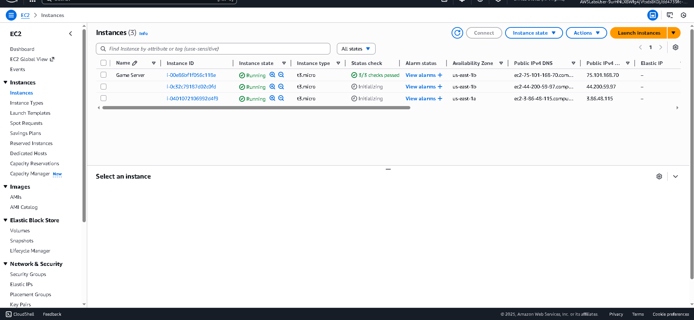
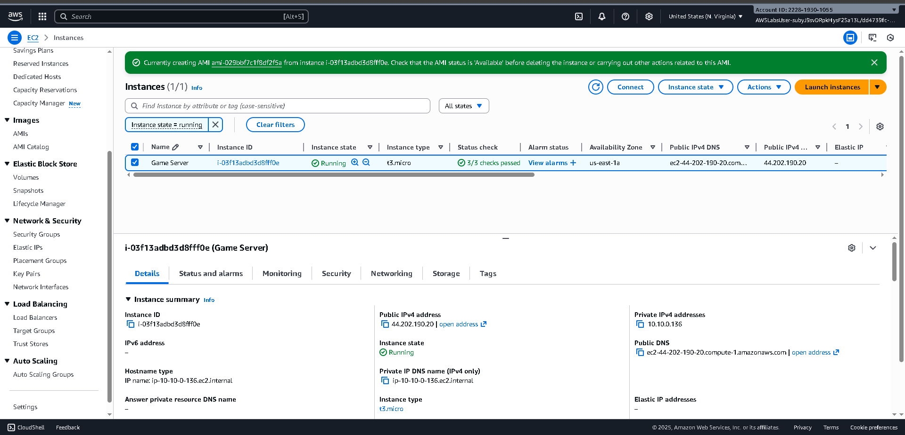

# Auto Scaling Application on Amazon EC2

## Lab Overview
This lab demonstrates how to design and deploy a scalable application on Amazon EC2 using Auto Scaling. The goal is to ensure application availability and elasticity by automatically adjusting the number of EC2 instances based on demand.

A game server application was used as the workload to simulate real-world scaling behavior.

---

## Step 1: Launching and Validating the Initial EC2 Instance
An EC2 instance was launched to host the game server application. This instance served as the baseline configuration and was verified to be running correctly before being used to create a reusable image.

Key characteristics:
- Instance type: `t3.micro`
- Instance state: Running
- Public IPv4 address assigned
- Application accessible via browser

This step ensures the application is functional before scaling is introduced.

---

## Step 2: Creating an Amazon Machine Image (AMI)
Once the EC2 instance was confirmed to be running correctly, an Amazon Machine Image (AMI) was created from it. The AMI captures the operating system, application configuration, and dependencies required to launch identical instances.

This AMI serves as the base image for all instances launched by Auto Scaling.

---

## Step 3: Creating a Launch Template
A launch template was created to define how new EC2 instances should be launched by the Auto Scaling group.

Configuration included:
- AMI created from the game server instance
- Instance type: `t3.micro`
- Existing key pair selected
- Existing security group selected to allow web traffic

The launch template standardizes instance configuration and ensures consistency across scaled instances.

---

## Step 4: Creating an Auto Scaling Group
An Auto Scaling group named **RegularCustomerGameServer** was created using the launch template.

The Auto Scaling group defines:
- Where instances are launched
- How many instances should run
- How scaling behavior is managed

This group is responsible for maintaining application availability as demand changes.

---

## Step 5: Configuring Group Size and Scaling Limits
The group size and scaling limits were configured to control how the application scales.

Settings applied:
- Desired capacity: 2 instances
- Minimum capacity: 2 instances
- Maximum capacity: 4 instances

This configuration ensures high availability while preventing uncontrolled cost growth.

---

## Step 6: Configuring Automatic Scaling
Automatic scaling was enabled using a target tracking scaling policy. This allows the Auto Scaling group to automatically add or remove EC2 instances based on CloudWatch metrics such as CPU utilization.

Although no dynamic policies were triggered during the lab, this configuration prepares the environment for real-time scaling under load.

---

## Step 7: Verifying Scaled EC2 Instances
After the Auto Scaling group was active, multiple EC2 instances were launched automatically based on the desired capacity setting.

This confirms that:
- The launch template is working correctly
- The AMI is valid
- Auto Scaling is successfully provisioning instances

---

## Step 8: Application Accessibility Verification
The game server application was accessed using the public IPv4 address of a running EC2 instance. The application interface loaded successfully, confirming that scaled instances are serving traffic correctly.

This validates end-to-end functionality from infrastructure to application layer.

---

## Architecture Summary
- Amazon EC2 used to host application instances
- Custom AMI created from a validated EC2 instance
- Launch template used for standardized instance deployment
- Auto Scaling group maintains desired capacity
- Automatic scaling configured for elasticity

---

## Key AWS Services Used
- Amazon EC2
- Amazon Machine Image (AMI)
- Launch Templates
- Auto Scaling Groups
- Amazon CloudWatch

---

## Outcome
The lab successfully demonstrates how Auto Scaling can be used to deploy a resilient and scalable application on AWS. The environment automatically provisions and manages EC2 instances, ensuring availability while optimizing resource usage.

